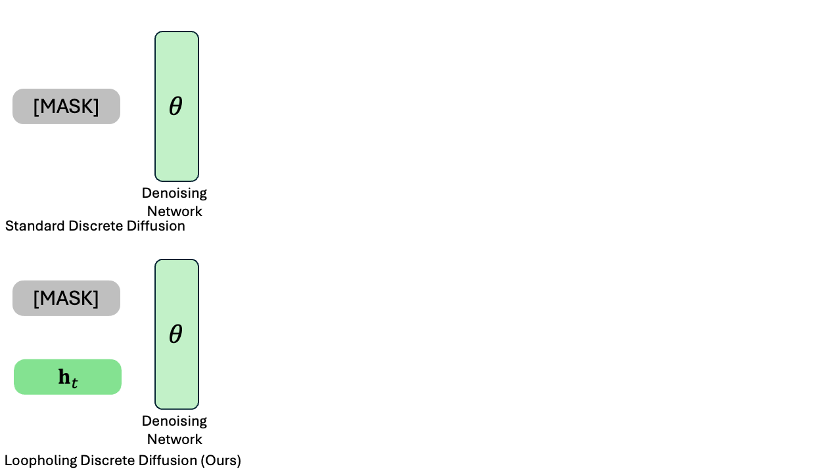

# Loopholing Discrete Diffusion Models (LDDM)

[[Paper]](https://arxiv.org/abs/2510.19304) [[Project Page]](https://sites.google.com/view/lddms/home)

This repository provides the official PyTorch implementation for **Loopholing Discrete Diffusion Models (LDDMs)**.
Our work demonstrates how maintaining latent embeddings that preserve prediction information in discrete diffusion enables significant performance improvements in text generation tasks.



## Installation

```bash
conda create -n lddm python=3.12
conda activate lddm
conda install nvidia/label/cuda-12.4.0::cuda-toolkit
pip install -r requirements.txt
pip install flash_attn==2.7.4.post1
```

## Training

Training scripts are available in `scripts/train/`:
- **LM1B**: `train_lm1b_lddm_m.sh`, `train_lm1b_lddm_u.sh`
- **OpenWebText**: `train_owt_lddm_m.sh`, `train_owt_lddm_u.sh`

Example:
```bash
bash scripts/train/train_lm1b_lddm_m.sh
```

## Evaluation

Evaluation scripts are in `scripts/eval/`:
- **Perplexity**: `eval_lm1b_lddm_m.sh`, `eval_owt_lddm_m.sh`
- **Generation**: `gen_owt_lddm_m.sh`

Downstream task scripts are in `scripts/lm_eval/`:
- **Downstream**: `lm_eval.sh`

Example:
```bash
bash scripts/eval/eval_owt_lddm_m.sh
```

## Baselines

Baseline implementations (SEDD, MDLM, UDLM, D3PM, AR) are also included:
- Training: `scripts/train/train_*_{sedd,mdlm,udlm}.sh`
- Evaluation: `scripts/eval/eval_*_{sedd,mdlm,udlm}.sh`

## Citation

```bibtex
@misc{jo2025loopholingdiscretediffusiondeterministic,
      title={Loopholing Discrete Diffusion: Deterministic Bypass of the Sampling Wall}, 
      author={Mingyu Jo and Jaesik Yoon and Justin Deschenaux and Caglar Gulcehre and Sungjin Ahn},
      year={2025},
      eprint={2510.19304},
      archivePrefix={arXiv},
      primaryClass={cs.LG},
      url={https://arxiv.org/abs/2510.19304}, 
}
```

## Acknowledgements

This repository is based on [DUO](https://github.com/s-sahoo/duo).
